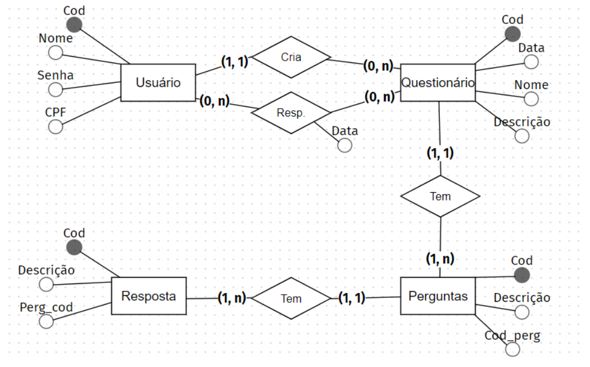

# Web Quiz

Olá, esse foi um desafio para criar um sistema de questionários com base no seguinte diagrama:



Para realizar o desafio, utilizei o NestJs com PostgreSQL para fazer a API e Nextjs no frontend.

## Documentação

### Rodando localmente

O ambiente de desenvolvimento utiliza o docker para subir as duas aplicações (API e frontend), o banco de dados e um admin para visualizar o banco em tempo real (adminer).

Além disso, os scripts de instalação de dependências também está inserido no script de build dos containeres, então, ao rodar o `docker compose up`, todas as dependencias já são pré-instaladas:

```
docker compose up -d
```

Frontend: `http://localhost:3001/`
API: `http://localhost:3000/`
Documentação da API: `http://localhost:3000/api`

## Próximos passos

- Adicionar um WYSIWYG para o campo de enunciado das perguntas
- Adicionar autenticação (JWT)
- Server-side Pagination
- Fixtures para popular a base de dados
- Validações de CPF
- Tratamento de erros da API
- Integrar com o GCP
