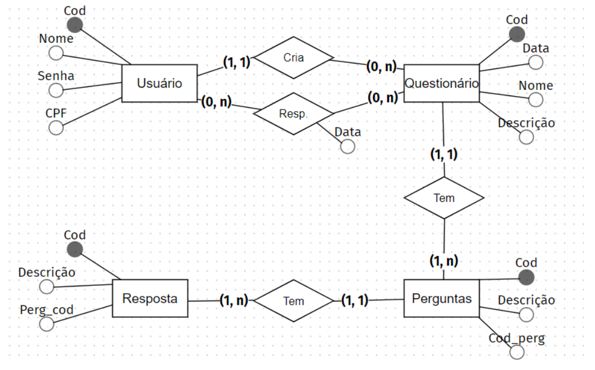

# Web Quiz

Olá, esse foi um desafio para criar um sistema de questionários com base no seguinte diagrama:



Para realizar o desafio, utilizei o NestJs com PostgreSQL para o backend e Nextjs no frontend.

## Documentação

Rodando localmente

```
docker compose up
```

## Próximos passos

- Adicionar um WYSIWYG para o campo de enunciado das perguntas
- Adicionar autenticação (JWT)
- Server-side Pagination
- Fixtures para popular a base de dados
- Validações de CPF
- Tratamento de erros da API
